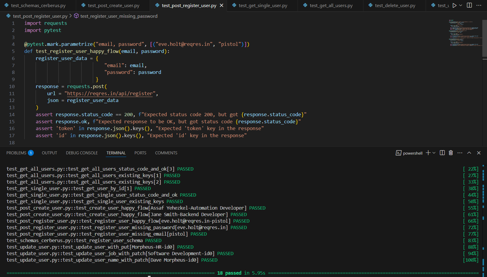

# API Testing with Python

This project is part of my learning journey in API testing using Python. It includes various test scripts that validate API responses, status codes, and data integrity. I am using [ReqRes](https://reqres.in), a mock API for testing, to practice different testing scenarios such as user registration, authentication, and data retrieval.



## Tech Stack
- Python
- `requests`
- `pytest`
- ReqRes API ([https://reqres.in](https://reqres.in))

## Running the Tests

1. Clone the repository:
   ```bash
   git clone https://github.com/your-username/api-testing-python.git
   cd api-testing-python
